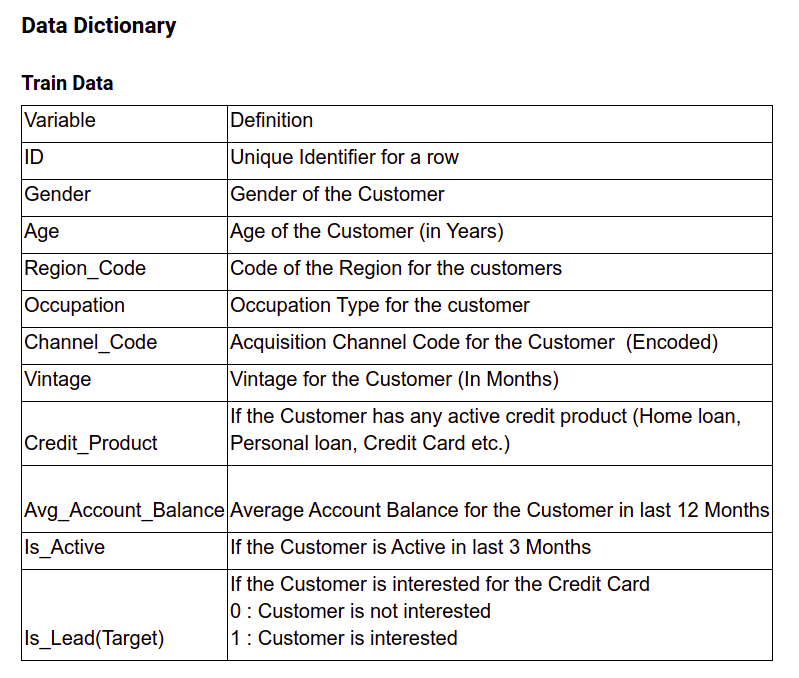

# AV Job-A-thon 2021

## Approach:
1. First we observe that the feature `Credit_Product` has missing values. We use imputation here to fill all the values. Here we mark 'Unknown' for each `NaN` values.
2. Since after training on the data-set we get to know that the feature `Credit_Product` has highest feature importance. So we will now try to break the "Unknown" value into "U1" and "U0" as per our target variable `Is_Lead`.
4. Now we want to predict correct `Credit_Product` featue from rest of our dataset. So we train a `RandomForestClassifier` for classification of `Credit_Product` feature. After training, we will add all the probabilities of `Credit_Product` in the train data itself and for test data also.
5. Now we use `CatBoostClassifier` to train the data for the target variable `Is_Lead`.
6. After that we evaluate its roc-auc score.
7. Now we predict the target variable `Is_Lead` for the test data and save it to `Predictions.csv`.

- The Notebook file is `Main.ipynb`.
- The Prediction file is `Predictions.csv`.
- The EDA is performed in `EDA.ipynb`.
- - - - -

[Link to Competition](https://datahack.analyticsvidhya.com/contest/job-a-thon-2/?utm_source=datahack&utm_medium=Navbar&utm_campaign=Jobathon#LeaderBoard)
